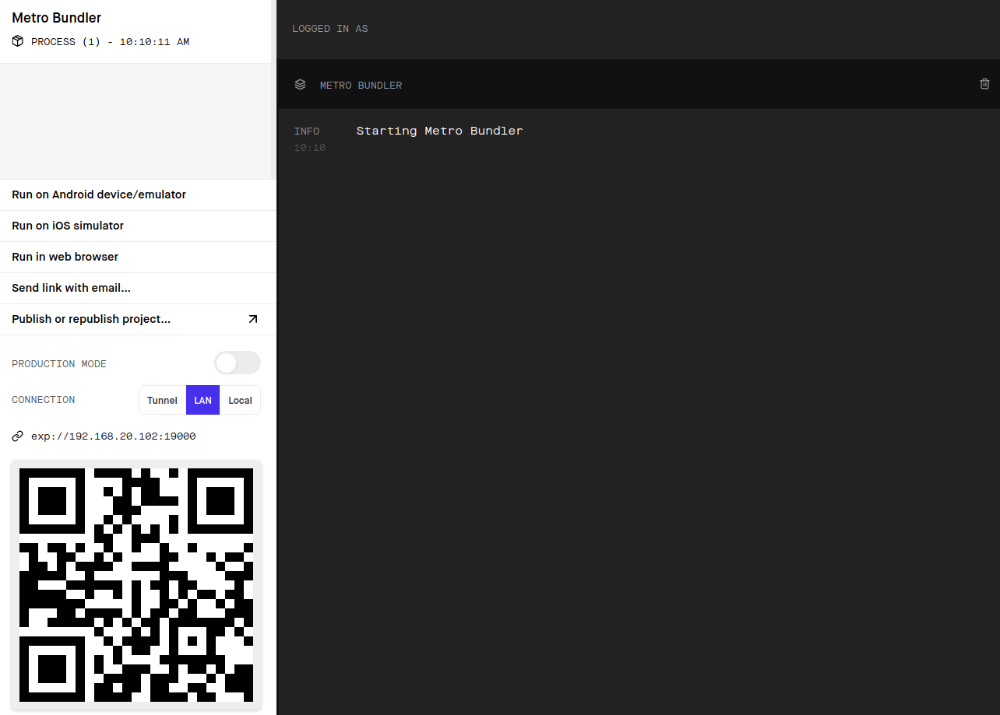
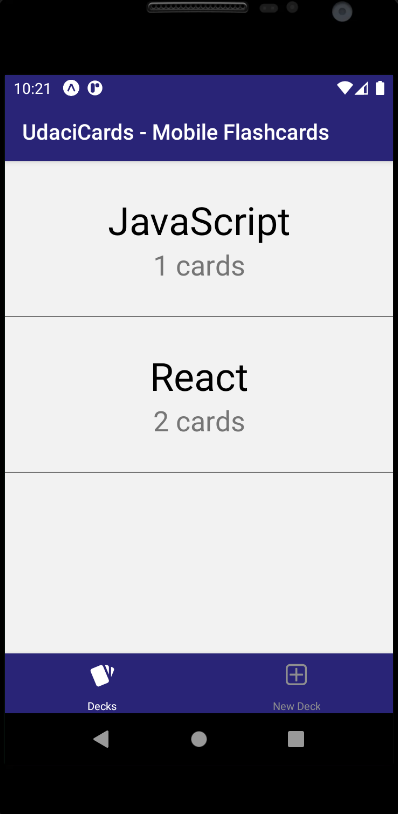

# Mobile Flashcards - Create Flashcards and Take Quizzes

mobile-flashcards is a mobile application that allow users to create an unlimited amount of flashcards, organize them into decks, and take quizzes on them.

The app was developed with React Native/Expo and was created with create-react-native-app. It uses Redux for state management.

## Features

The interface includes the following screens and features:

- The _Main Screen_ displays a list of decks along with the number of cards in each deck.
- Long pressing on a deck will bring up an alert box to confirm deleting the deck. Note that this will delete all cards belonging to the deck as well.
- Tapping on a deck will navigate to its _Individual Deck Screen_ which displays information about the deck as well as options to create a new card or start a quiz on this specific deck.
- The _Quiz Screen_ displays the card question with ability to flip back and forth to the answer. The user can mark their guesses and progress is displayed. After the last question, the quiz score is displayed with option of starting over.
- The _New Deck Screen_ allows the user to create new deck title.
- The _Add Card Screen_ allows the user to create and add new cards to add to a specific deck.

## Usage

Navigate between _Deck Flow_ and _Create New Deck_ screens using the **Tab Navigator** at the bottom.

The _Deck Flow_ navigates through the remaining screens using a **Stack Navigator**.

Sample Usage:

- At initial launch of the app, there will be no decks. Press the _New Deck_ button on the bottom tab navigator to start creating decks.
- At the _Main Screen_ select a deck and add cards to the deck.
- After adding some cards, select _Quiz_ to start taking a quiz and receive a score at the end.
- Continue adding cards or take quizzes from other decks.

### Install Dependencies

```
npm install
```

This project takes advantage of [Expo CLI](https://docs.expo.io/get-started/installation/) and the Expo client to open the project on iOS and Android. Expo CLI can be installed with:

```
npm install --global expo-cli
```

An iOS/Android device or emulator is required to run the application.

### Run

This project was created with create-react-native-app. Running `npm start` will start the development server.

```
npm start
```

However, I find using expo CLI was more straight forward:

```
expo start
```

This starts Metro Bundler, an HTTP server that compiles the JavaScript code and serves it to the Expo app. From here, either scan the QR code with your device, or start an emulator and click the respective buttons on the left pane to run on the emulator.




## Project Details

This project is part of Udacity's React course, and built to the specifications based on the project rubric. No starter files were provided.

The backend uses React Native's AsyncStorage to store, retrieve, and persist data used by the app. Redux action creators dispatches actions to update the state and calls the API to update AsyncStorage data to keep them in sync.

### Testing

The project was tested on a physical Android device and Android emulator.

## License

This project is licensed under the MIT License - see the [LICENSE](LICENSE) file for details.
